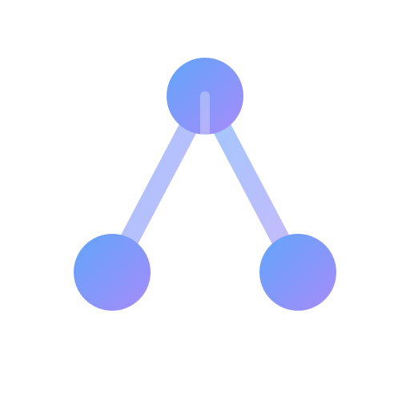

<div align="center">
  
  <h1>CogniGraph</h1>
</div>

**CogniGraph** is an AI-powered Knowledge Graph Explorer that transforms static documents into interactive, navigable visualizations. Upload any PDF or text file, and watch as it extracts key entities and relationships, allowing you to "see" the structure of your data and chat with it in real-time.

---

## 🚀 Features

- **📄 Universal Document Support**: Handles **PDFs** (native text), **Scanned PDFs** (via OCR/Tesseract), **TXT**, and **Markdown** files.
- **🕸️ Interactive Knowledge Graph**: Visualize complex relationships between people, organizations, and concepts using a force-directed graph.
- **💬 Context-Aware Chat**: Chat with your document using **RAG (Retrieval-Augmented Generation)**. The AI answers strictly from the document's content.
- **🔍 Smart OCR Fallback**: Automatically detects scanned/image-based PDFs and applies OCR to extract text.
- **⚡ Rate Limit Handling**: Intelligent error handling that pauses and auto-retries when API limits are hit.
- **📱 Responsive Design**: Fully optimized for Desktop and Mobile usage.

---

## 🛠️ Tech Stack

### Frontend
- **React 18** (Vite)
- **Tailwind CSS** (Styling & Dark Mode)
- **React-Force-Graph** (2D/3D Visualization)
- **Lucide React** (Icons)

### Backend
- **FastAPI** (Python)
- **NetworkX** (Graph Construction)
- **ChromaDB** (Vector Database for RAG)
- **Pytesseract** & **PDF2Image** (OCR Engine)
- **Azure AI Inference** (GitHub Models / GPT-4o Mini)

---

## ⚙️ Prerequisites

Before running the project, ensure you have the following installed:

1.  **Node.js** & **npm** (for Frontend)
2.  **Python 3.10+** (for Backend)
3.  **System Tools** (Required for OCR):
    *   **macOS**: `brew install tesseract poppler`
    *   **Ubuntu**: `sudo apt-get install tesseract-ocr poppler-utils`
    *   **Windows**: Install [Tesseract](https://github.com/UB-Mannheim/tesseract/wiki) and [Poppler](https://github.com/oschwartz10612/poppler-windows).

---

## 🔧 Installation

1.  **Clone the Repository**
    ```bash
    git clone https://github.com/iammanoj807/cognigraph.git
    cd cognigraph
    ```

2.  **Setup Environment Variables**
    Create a `.env` file in the `backend/` directory:
    ```bash
    cd backend
    cp .env.example .env
    ```
    Open `.env` and add your **GitHub Models API Key**:
    ```ini
    MODEL_API_KEY=your_key_here
    ```
    > 🔑 *Get a free key from the [GitHub Models Marketplace](https://github.com/settings/tokens/new).*

---

## ▶️ How to Run

We have included a convenient script to start both the Backend and Frontend simultaneously.

1.  **Make the script executable** (first time only):
    ```bash
    chmod +x run.sh
    ```

2.  **Start the App**:
    ```bash
    ./run.sh
    ```

This will automatically:
*   Create a Python virtual environment (`venv`).
*   Install Python requirements.
*   Start the **FastAPI Backend** on `http://localhost:8000`.
*   Start the **React Frontend** on `http://localhost:5173`.

---

## ⚠️ Troubleshooting

**1. "401 Unauthorized" Error**
*   Your API Key is invalid or expired.
*   Get a new key from [GitHub Models](https://github.com/settings/tokens/new) and update `backend/.env`.

**2. "Poppler/Tesseract not installed"**
*   The app cannot read scanned PDFs without these tools.
*   Run `brew install poppler tesseract` (Mac) to fix it.

**3. "Address already in use"**
*   Another program is using port 8000 or 5173.
*   Kill the process or restart your computer.

---

## 📜 License

Distributed under the MIT License. See `LICENSE` for more information.

---

Made with ❤️ by Manoj Kumar Thapa
